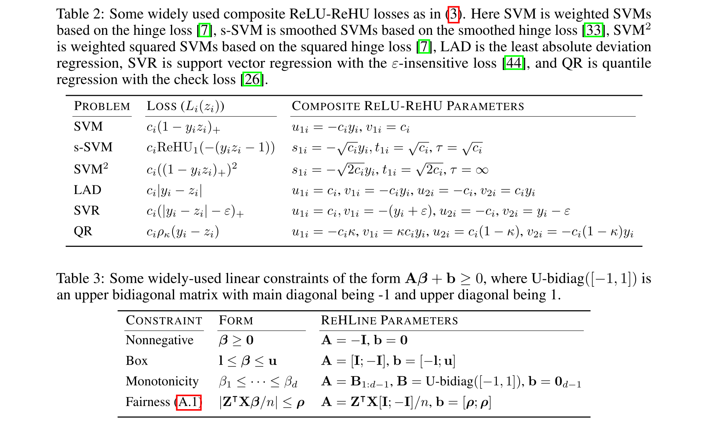

# ReHLine 

**ReHLine** is designed to be a computationally efficient and practically useful software package for large-scale empirical risk minimization (ERM) problems.

- GitHub repo: [https://github.com/softmin/ReHLine-python](https://github.com/softmin/ReHLine-python) 
- Documentation: [https://rehline-python.readthedocs.io](https://rehline-python.readthedocs.io)
- PyPi: [https://pypi.org/project/rehline](https://pypi.org/project/rehline)
- Open Source: [MIT license](https://opensource.org/licenses/MIT)
- Paper: [NeurIPS | 2023](https://openreview.net/pdf?id=3pEBW2UPAD)

The **ReHLine** solver has four appealing
"linear properties":

- It applies to any convex piecewise linear-quadratic loss function, including the hinge loss, the check loss, the Huber loss, etc.
- In addition, it supports linear equality and inequality constraints on the parameter vector.
- The optimization algorithm has a provable linear convergence rate.
- The per-iteration computational complexity is linear in the sample size.

## 📝 Formulation

**ReHLine** is designed to address the empirical regularized ReLU-ReHU minimization problem, named *ReHLine optimization*, of the following form:

$$
\min_{\mathbf{\beta} \in \mathbb{R}^d} \sum_{i=1}^n \sum_{l=1}^L \text{ReLU}( u_{li} \mathbf{x}_ i^\intercal \mathbf{\beta} + v_{li}) + \sum_{i=1}^n \sum_{h=1}^H {\text{ReHU}}_ {\tau_{hi}}( s_{hi} \mathbf{x}_ i^\intercal \mathbf{\beta} + t_{hi}) + \frac{1}{2} \| \mathbf{\beta} \|_2^2, \qquad \text{ s.t. } \mathbf{A} \mathbf{\beta} + \mathbf{b} \geq \mathbf{0},
$$

where $\mathbf{U} = (u_{li}),\mathbf{V} = (v_{li}) \in \mathbb{R}^{L \times n}$ and $\mathbf{S} = (s_{hi}),\mathbf{T} = (t_{hi}),\mathbf{\tau} = (\tau_{hi}) \in \mathbb{R}^{H \times n}$ are the ReLU-ReHU loss parameters, and $(\mathbf{A},\mathbf{b})$ are the constraint parameters.
The ReLU and ReHU functions are defined as $\mathrm{ReLU}(z)=\max(z,0)$ and

$$
\mathrm{ReHU}_\tau(z) =
  \begin{cases}
  \ 0,                     & z \leq 0 \\
  \ z^2/2,                 & 0 < z \leq \tau \\
  \ \tau( z - \tau/2 ),   & z > \tau
  \end{cases}.
$$

This formulation has a wide range of applications spanning various fields, including statistics, machine learning, computational biology, and social studies. Some popular examples include SVMs with fairness constraints (FairSVM), elastic net regularized quantile regression (ElasticQR), and ridge regularized Huber minimization (RidgeHuber).

## ⌛ Benchmark (powered by benchopt)

Some existing problems of recent interest in statistics and machine
learning can be solved by **ReHLine**, and we provide reproducible
benchmark code and results at the
[ReHLine-benchmark](https://github.com/softmin/ReHLine-benchmark) repository.

| Problem   |      Results      |
|---------- |:-----------------:|
|[FairSVM](https://github.com/softmin/ReHLine-benchmark/tree/main/benchmark_FairSVM) | [Result](https://rehline-python.readthedocs.io/en/latest/_static/benchmark/benchmark_FairSVM.html)|
|[ElasticQR](https://github.com/softmin/ReHLine-benchmark/tree/main/benchmark_QR) | [Result](https://rehline-python.readthedocs.io/en/latest/_static/benchmark/benchmark_QR.html)|
|[RidgeHuber](https://github.com/softmin/ReHLine-benchmark/tree/main/benchmark_Huber) | [Result](https://rehline-python.readthedocs.io/en/latest/_static/benchmark/benchmark_Huber.html)|
|[SVM](https://github.com/softmin/ReHLine-benchmark/tree/main/benchmark_SVM) | [Result](https://rehline-python.readthedocs.io/en/latest/_static/benchmark/benchmark_SVM.html)|
|[Smoothed SVM](https://github.com/softmin/ReHLine-benchmark/tree/main/benchmark_sSVM) | [Result](https://rehline-python.readthedocs.io/en/latest/_static/benchmark/benchmark_sSVM.html)|

## 🧾 Overview of Results

